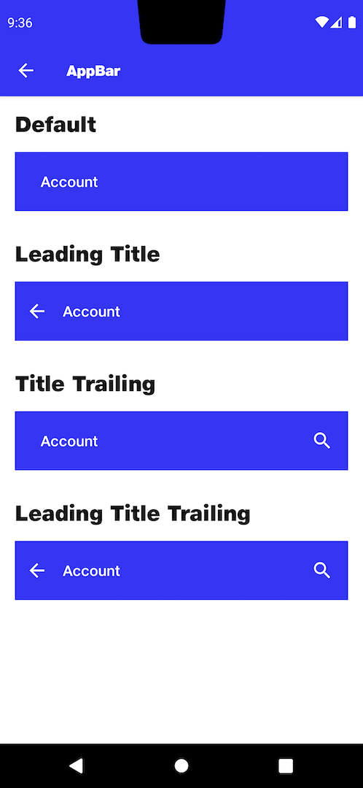

# AppBar

## Default
```kotlin
NitrozenAppBar(
    title = "Account",
    modifier = Modifier.padding(top = 16.dp)
)
```
## Leading Title
```kotlin
NitrozenAppBar(
    title = "Account",
    leading = {
        IconButton(
            onClick = {},
            modifier = Modifier.size(24.dp)
        ) {
            Icon(
                imageVector = Icons.Default.ArrowBack,
                contentDescription = null,
                tint = NitrozenTheme.colors.background
            )
        }
    },
    modifier = Modifier.padding(top = 16.dp)
)
```
## Title Trailing
```kotlin
NitrozenAppBar(
    title = "Account",
    trailing = {
        IconButton(
            onClick = {},
            modifier = Modifier.size(24.dp)
        ) {
            Icon(
                imageVector = Icons.Default.Search,
                contentDescription = null,
                tint = NitrozenTheme.colors.background
            )
        }
    },
    modifier = Modifier.padding(top = 16.dp)
)
```
## Leading Title Trailing
```kotlin
NitrozenAppBar(
    title = "Account",
    trailing = {
        IconButton(
            onClick = {},
            modifier = Modifier.size(24.dp)
        ) {
            Icon(
                imageVector = Icons.Default.Search,
                contentDescription = null,
                tint = NitrozenTheme.colors.background
            )
        }
    },
    leading = {
        IconButton(
            onClick = {},
            modifier = Modifier.size(24.dp)
        ) {
            Icon(
                imageVector = Icons.Default.ArrowBack,
                contentDescription = null,
                tint = NitrozenTheme.colors.background
            )
        }
    },
    modifier = Modifier.padding(top = 16.dp)
)
```

## Preview
