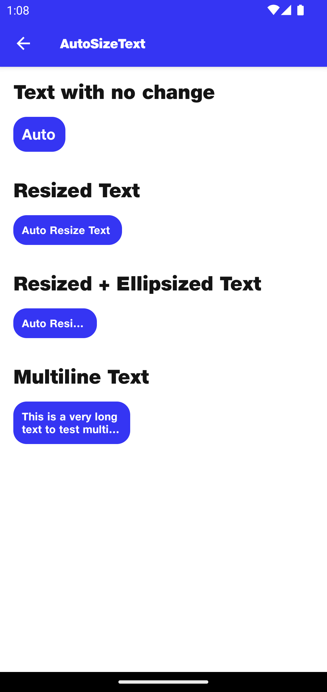

# AutoResizeText

## Text with no change
```kotlin
Box(
    modifier = Modifier
        .background(
            color = NitrozenTheme.colors.primary50,
            shape = NitrozenTheme.shapes.rounded16
        )
        .padding(10.dp)
        .width(42.dp)
) {
    NitrozenAutoResizeText(
        modifier = Modifier,
        text = "Auto"
    )
}
```

## Resized Text
```kotlin
Box(
    modifier = Modifier
        .background(
            color = NitrozenTheme.colors.primary50,
            shape = NitrozenTheme.shapes.rounded16
        )
        .padding(10.dp)
        .width(110.dp)
) {
    NitrozenAutoResizeText(
        modifier = Modifier,
        text = "Auto Resize Text"
    )
}
```

## Resized + Ellipsized Text
```kotlin
Box(
    modifier = Modifier
        .background(
            color = NitrozenTheme.colors.primary50,
            shape = NitrozenTheme.shapes.rounded16
        )
        .padding(10.dp)
        .width(80.dp)
) {
    NitrozenAutoResizeText(
        modifier = Modifier,
        text = "Auto Resize Text",
        configuration = NitrozenAutoResizeTextConfiguration(
            minFontSize = 12.sp,
            maxLines = 1
        )
    )
}
```

## Multiline Text
```kotlin
Box(
    modifier = Modifier
        .background(
            color = NitrozenTheme.colors.primary50,
            shape = NitrozenTheme.shapes.rounded16
        )
        .padding(10.dp)
        .width(120.dp)
) {
    NitrozenAutoResizeText(
        modifier = Modifier,
        text = "This is a very long text to test multiline text",
        configuration = NitrozenAutoResizeTextConfiguration(
            minFontSize = 12.sp,
            maxLines = 2
        )
    )
}
```


## Preview
