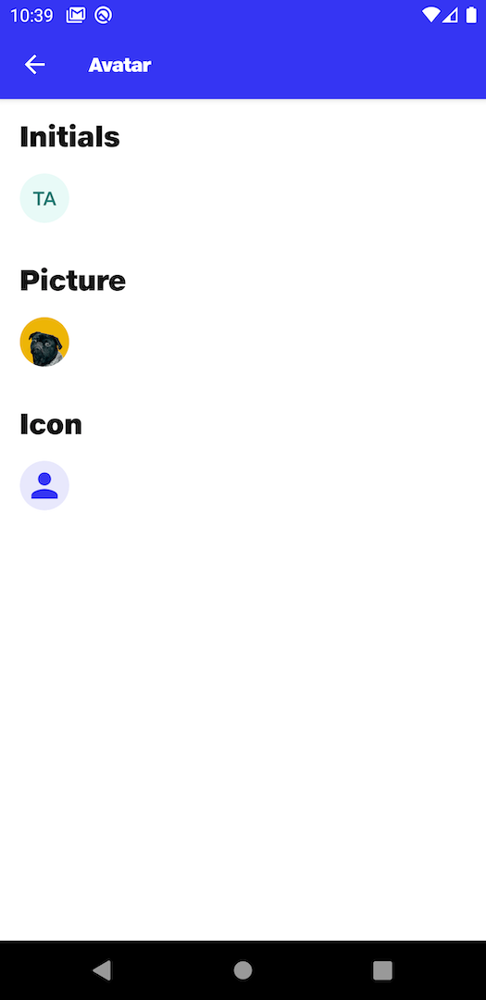

# Avatar

## Initials
```kotlin
NitrozenNameAvatar(
    modifier = Modifier
        .padding(top = 16.dp),
    name = "Test Avatar"
)
```

## Picture
```kotlin
NitrozenPictureAvatar(
    modifier = Modifier
        .padding(top = 16.dp),
){
    Image(
        modifier = Modifier,
        painter = painterResource(id = R.drawable.cat),
        contentDescription = null
    )
}
```

## Icon
```kotlin
NitrozenIconAvatar(
    modifier = Modifier
        .padding(top = 16.dp),
){
    Icon(
        modifier = Modifier
            .size(32.dp),
        imageVector = Icons.Default.Person,
        contentDescription = null
    )
}
```

## Preview
