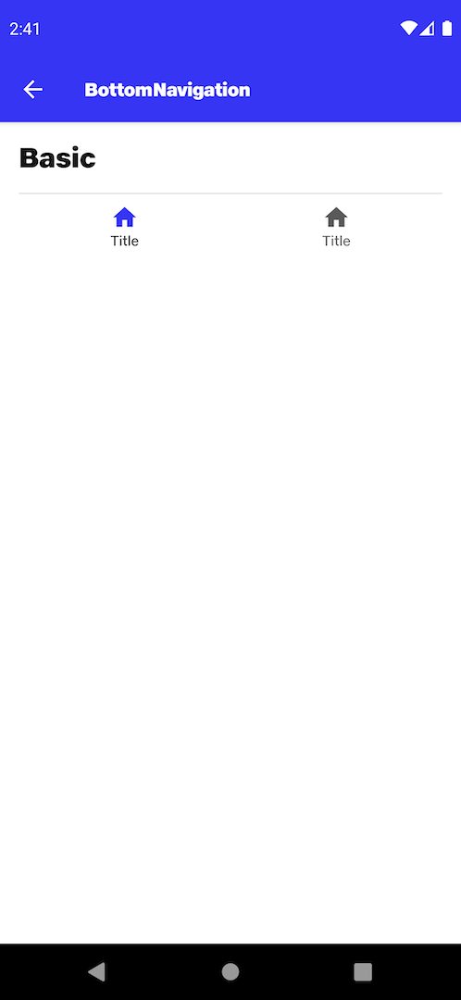

# Badge

## Default
```kotlin
NitrozenBottomNavigation(
    items = listOf(
        BottomNavItem(1, R.string.nit_bottom_nav_item_title, R.drawable.ic_nit_home),
        BottomNavItem(2, R.string.nit_bottom_nav_item_title, R.drawable.ic_nit_home)
    ),
    onClick = {},
    selectedItem = BottomNavItem(1, R.string.nit_bottom_nav_item_title, R.drawable.ic_nit_home),
)
```

## Preview

