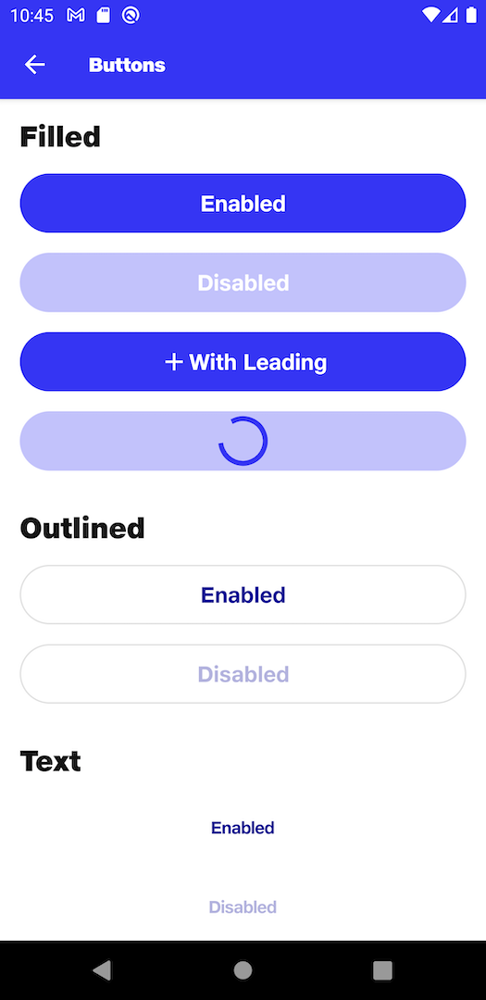

# Buttons

## Filled Button
```kotlin
NitrozenFilledButton(
    text = "Enabled",
    enabled = true,
    onClick = {},
    modifier = Modifier.fillMaxWidth()
)
```

## Filled Button - With Leading
```kotlin
NitrozenFilledButton(
    text = "With Leading",
    enabled = true,
    onClick = {},
    modifier = Modifier.fillMaxWidth(),
    leading = {
        Icon(
            imageVector = Icons.Default.Add,
            contentDescription = null,
            tint = Color.White
        )
    }
)
```

## Outlined Button
```kotlin
NitrozenOutlinedButton(
    text = "Enabled",
    enabled = true,
    onClick = {},
    modifier = Modifier.fillMaxWidth(),
)
```

## Text Button
```kotlin
NitrozenTextButton(
    text = "Enabled",
    enabled = true,
    onClick = {},
    modifier = Modifier.fillMaxWidth(),
)
```

## Preview

