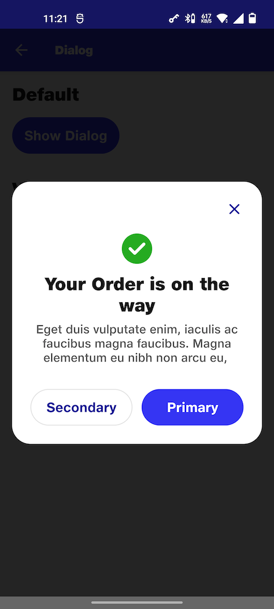
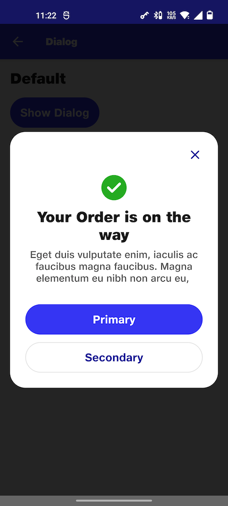
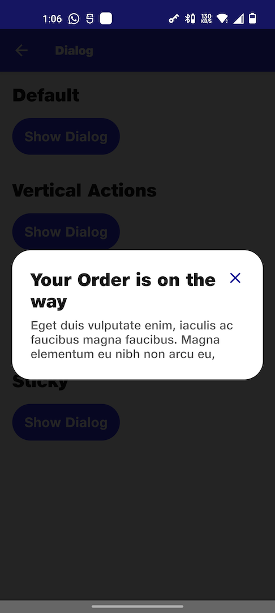
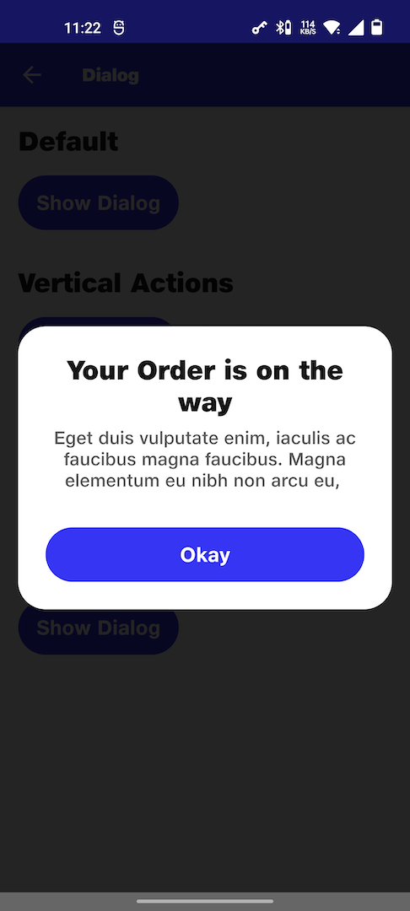

# Dialog

## Default
```kotlin
NitrozenDialog(
    title = "Your Order is on the way",
    subTitle = "Eget duis vulputate enim, " +
            "iaculis ac faucibus magna faucibus." +
            " Magna elementum eu nibh non arcu eu, ",
    positiveLabel = "Primary",
    negativeLabel = "Secondary",
    icon = R.drawable.ic_dialog_checked,
    positiveButtonClick = {
        showDefaultDialog.value = false
    },
    negativeButtonClick = {
        showDefaultDialog.value = false
    },
    onDismissRequest = {
        showDefaultDialog.value = false
    }
)
```

## Vertical actions
```kotlin
NitrozenDialog(
    title = "Your Order is on the way",
    subTitle = "Eget duis vulputate enim, " +
        "iaculis ac faucibus magna faucibus." +
        " Magna elementum eu nibh non arcu eu, ",
    positiveLabel = "Primary",
    negativeLabel = "Secondary",
    icon = R.drawable.ic_dialog_checked,
    positiveButtonClick = {
        showVerticalActions.value = false
    },
    negativeButtonClick = {
        showVerticalActions.value = false
    },
    configuration = NitrozenDialogConfiguration.Default.copy(
        direction = ActionDirection.Vertical
    ),
    onDismissRequest = {
        showVerticalActions.value = false
    }
)
```

## Informational dialog
```kotlin
NitrozenDialog(
    title = "Your Order is on the way",
    subTitle = "Eget duis vulputate enim, " +
        "iaculis ac faucibus magna faucibus." +
        " Magna elementum eu nibh non arcu eu, ",
    configuration = NitrozenDialogConfiguration.Default.copy(
        textAlign = TextAlign.Start
    ),
    onDismissRequest = {
        showInformationalDialog.value = false
    }
)
```

## Sticky
```kotlin
NitrozenDialog(
    title = "Your Order is on the way",
    subTitle = "Eget duis vulputate enim, " +
        "iaculis ac faucibus magna faucibus." +
        " Magna elementum eu nibh non arcu eu, ",
    configuration = NitrozenDialogConfiguration.Default.copy(
        showCancelIcon = false,
        dismissOnClickOutside = false,
        dismissOnBackPress = false
    ),
    positiveLabel = "Okay",
    positiveButtonClick = {
        showStickyDialog.value = false
    },
    onDismissRequest = {
        showStickyDialog.value = false
    }
)
```

## Preview
| Default                                  | Vertical Actions                          | Informational                                  | Sticky                                  |
|------------------------------------------|-------------------------------------------|------------------------------------------------|-----------------------------------------|
|  |  |  |  |
