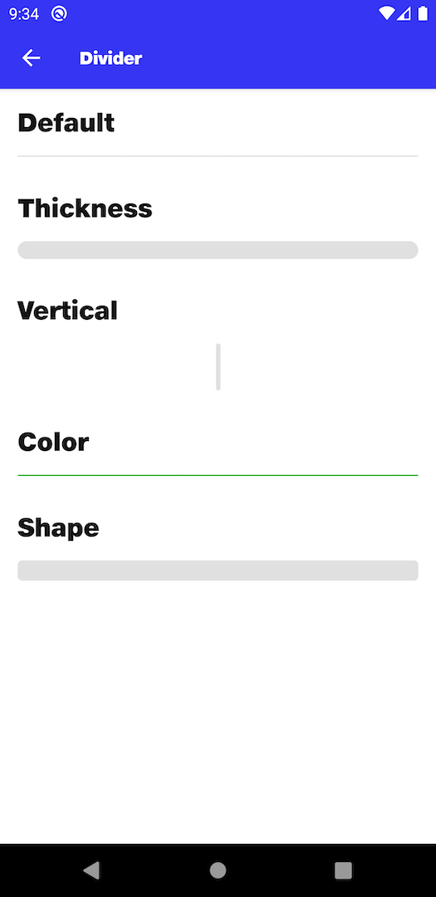

# Divider

## Default
```kotlin
NitrozenDivider(
    modifier = Modifier
        .padding(top = 16.dp),
)
```
## Thickness
```kotlin
NitrozenDivider(
    modifier = Modifier
        .padding(top = 16.dp),
    configuration = NitrozenDividerConfiguration.Default.copy(
        thickness = 16.dp
    )
)
```
## Vertical
```kotlin
NitrozenDivider(
    modifier = Modifier
        .padding(top = 16.dp)
        .height(42.dp),
    configuration = NitrozenDividerConfiguration.Default.copy(
        direction = NitrozenDividerConfiguration.Direction.Vertical,
        thickness = 4.dp
    )
)
```
## Color
```kotlin
NitrozenDivider(
    modifier = Modifier
        .padding(top = 16.dp),
    style = NitrozenDividerStyle.Default.copy(
        backgroundColor = NitrozenTheme.colors.success50
    )
)
```
## Shape
```kotlin
NitrozenDivider(
    modifier = Modifier
        .padding(top = 16.dp),
    style = NitrozenDividerStyle.Default.copy(
        shape = NitrozenTheme.shapes.small
    ),
    configuration = NitrozenDividerConfiguration.Default.copy(
        thickness = 18.dp
    )
)
```

## Preview
