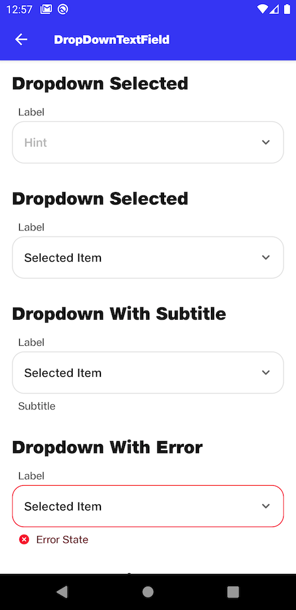

# DropDownTextField

## 
```kotlin
NitrozenDropDownTextField(
    modifier = Modifier
        .padding(top = 16.dp),
    label = "Label",
    hint = "Hint",
    onClicked = {},
    textFieldState = TextFieldState.Idle("Subtitle")
)
```

## Preview DropDownTextField

