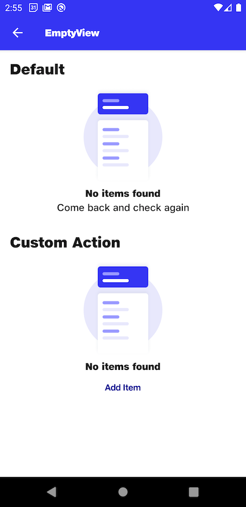

# EmptyView

## Default
```kotlin
NitrozenEmptyView(
    modifier = Modifier
        .fillMaxWidth()
        .padding(top = 16.dp),
    title = "No items found",
    subtitle = "Come back and check again"
)
```

## Custom Action
```kotlin
NitrozenEmptyView(
    modifier = Modifier
        .fillMaxWidth()
        .padding(top = 16.dp),
    title = "No items found",
    bottomContent = {
        NitrozenTextButton(
            modifier = Modifier,
            text = "Add Item",
            onClick = {

            }
        )
    }
)
```

## Preview
