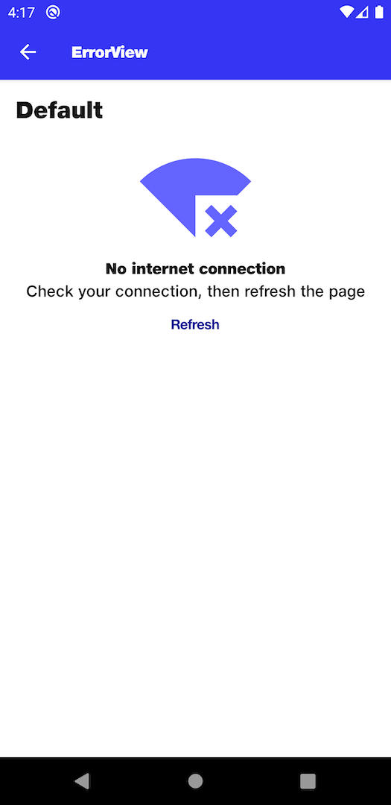

# ErrorView

## Default
```kotlin
NitrozenErrorView(
    modifier = Modifier
        .fillMaxWidth()
        .padding(top = 16.dp),
    title = "No internet connection",
    subtitle = "Check your connection, then refresh the page",
    topContent = {
         Icon(
             modifier = Modifier
                 .size(120.dp)
                 .padding(bottom = 8.dp),
             painter = painterResource(id = com.nitrozen.android.R.drawable.no_internet),
             contentDescription = null,
             tint = NitrozenTheme.colors.primary40
         )
    },
    bottomContent = {
        NitrozenTextButton(
            modifier = Modifier,
            text = "Refresh",
            onClick = {
    
            }
        )
    }
)
```

## Preview
