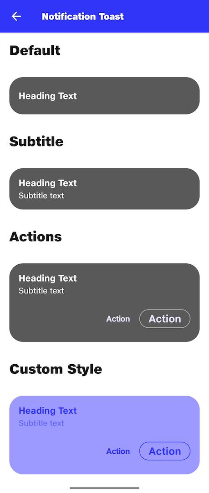

# Notification Toast

## Default
```kotlin
NitrozenNotificationToast(
    title = "Heading Text"
)
```

## Subtitle
```kotlin
NitrozenNotificationToast(
    title = "Heading Text",
    subTitle = "Subtitle text",
)

```

## Actions
```kotlin
NitrozenNotificationToast(
    title = "Heading Text",
    subTitle = "Subtitle text",
    primaryAction = NotificationAction("Action"){

    },
    secondaryAction = NotificationAction("Action"){

    }
)

```

## Custom Style
```kotlin
NitrozenNotificationToast(
    title = "Heading Text",
    subTitle = "Subtitle text",
    primaryAction = NotificationAction("Action"){

    },
    secondaryAction = NotificationAction("Action"){

    },
    style = NitrozenNotificationStyle.Toast.Default.copy(
        backgroundColor = NitrozenTheme.colors.primary30,
        titleTextColor = NitrozenTheme.colors.primary50,
        subTitleColor = NitrozenTheme.colors.primary40,
        primaryButtonStyle = NitrozenButtonStyle.Outlined.Default.copy(
            textColorEnabled = NitrozenTheme.colors.primary50,
            backgroundColor = Color.Transparent,
            borderColor = NitrozenTheme.colors.primary50
        ),
        secondaryButtonStyle = NitrozenButtonStyle.Text.Default.copy(
            textColorEnabled = NitrozenTheme.colors.primary50
        )
    )
)

```

## Preview
