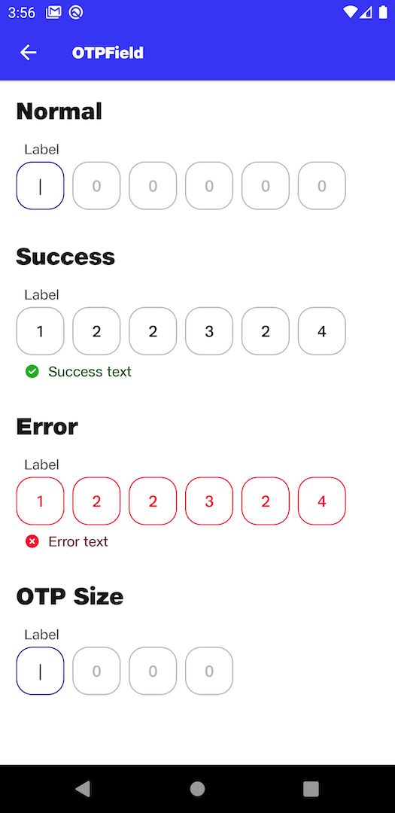

# OtpField

## Normal
```kotlin
NitrozenOtpTextField(
    label = "Label",
    otp = "",
    onOtpChange = {},
    onKeyboardDone = {

    }
)
```

## Success
```kotlin
NitrozenOtpTextField(
    label = "Label",
    otp = "122324",
    onOtpChange = {},
    onKeyboardDone = {

    },
    state = TextFieldState.Success("Success text")
)
```

## Error
```kotlin
NitrozenOtpTextField(
    label = "Label",
    otp = "122324",
    onOtpChange = {},
    onKeyboardDone = {

    },
    state = TextFieldState.Error("Error text")
)
```

## Otp Size
```kotlin
NitrozenOtpTextField(
    label = "Label",
    otp = "",
    otpSize = 4,
    onOtpChange = {},
    onKeyboardDone = {

    },
)
```

## Preview
