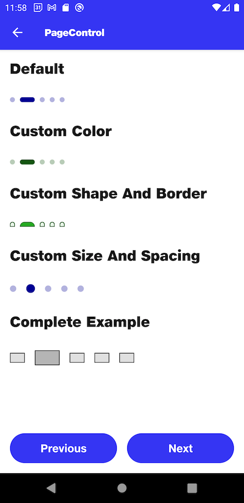

# PageControl

## Default

```kotlin
NitrozenPageControl(
    modifier = Modifier,
    dotCount = 5,
    selectedDot = 2
)
```

## Custom Color

```kotlin
NitrozenPageControl(
    modifier = Modifier,
    dotCount = 5,
    selectedDot = 2,
    style = NitrozenPageControlStyle.Default.copy(
        selectedDotStyle = NitrozenPageControlStyle.Default.selectedDotStyle.copy(
            color = NitrozenTheme.colors.success80,
        ),
        defaultDotStyle = NitrozenPageControlStyle.Default.defaultDotStyle.copy(
            color = NitrozenTheme.colors.success80.copy(
                alpha = 0.3f
            )
        )
    )
)
```

## Custom Shape And Border

```kotlin
NitrozenPageControl(
    modifier = Modifier,
    dotCount = 5,
    selectedDot = 2,
    style = NitrozenPageControlStyle.Default.copy(
        DotStyle(
            shape = NitrozenTheme.shapes.topRoundedXl,
            color = NitrozenTheme.colors.success50,
            borderWidth = 1.dp,
            borderColor = NitrozenTheme.colors.success80
        ),
        defaultDotStyle = DotStyle(
            shape = NitrozenTheme.shapes.topRoundedXl,
            color = NitrozenTheme.colors.success20,
            borderWidth = 1.dp,
            borderColor = NitrozenTheme.colors.success80
        )
    )
)
```

## Custom Size And Spacing

```kotlin
NitrozenPageControl(
    modifier = Modifier,
    dotCount = 5,
    selectedDot = 2,
    configuration = NitrozenPageControlConfiguration.Default.copy(
        selectedDotConfiguration = DotConfiguration(
            width = 14.dp,
            height = 14.dp
        ),
        defaultDotConfiguration = DotConfiguration(
            width = 10.dp,
            height = 10.dp
        ),
        dotSpacing = 16.dp
    )
)
```

## Complete Example

```kotlin
NitrozenPageControl(
    modifier = Modifier,
    dotCount = 5,
    selectedDot = 2,
    style = NitrozenPageControlStyle(
        selectedDotStyle = DotStyle(
            shape = RectangleShape,
            color = NitrozenTheme.colors.grey60,
            borderWidth = 1.dp,
            borderColor = NitrozenTheme.colors.grey100
        ),
        defaultDotStyle = DotStyle(
            shape = RectangleShape,
            color = NitrozenTheme.colors.grey40,
            borderWidth = 1.dp,
            borderColor = NitrozenTheme.colors.grey100
        )
    ),
    configuration = NitrozenPageControlConfiguration(
        selectedDotConfiguration = DotConfiguration(
            width = 40.dp,
            height = 24.dp
        ),
        defaultDotConfiguration = DotConfiguration(
            width = 24.dp,
            height = 16.dp
        ),
        dotSpacing = 16.dp
    )
)
```

## Preview
