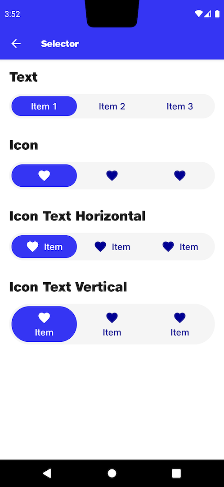

# Selector

## Text
```kotlin
val indexForText = remember {
    mutableStateOf(0)
}
NitrozenSelector(
    items = listOf(
        NitrozenSelectorItem.Text("Item 1"),
        NitrozenSelectorItem.Text("Item 2"),
        NitrozenSelectorItem.Text("Item 3"),
    ),
    selectedItemIndex = indexForText.value,
    onItemClick = {
        indexForText.value = it
    },
    modifier = Modifier
        .fillMaxWidth()
)
```
## Icon
```kotlin
val indexForIcon = remember {
    mutableStateOf(0)
}
NitrozenSelector(
    items = listOf(
        NitrozenSelectorItem.Icon(com.nitrozen.android.R.drawable.ic_heart),
        NitrozenSelectorItem.Icon(com.nitrozen.android.R.drawable.ic_heart),
        NitrozenSelectorItem.Icon(com.nitrozen.android.R.drawable.ic_heart),
    ),
    selectedItemIndex = indexForIcon.value,
    onItemClick = {
        indexForIcon.value = it
    },
    modifier = Modifier
        .fillMaxWidth()
)
```
## Icon Text Horizontal
```kotlin
val indexForIconTextH = remember {
    mutableStateOf(0)
}
NitrozenSelector(
    items = listOf(
        NitrozenSelectorItem.IconText("Item", com.nitrozen.android.R.drawable.ic_heart),
        NitrozenSelectorItem.IconText("Item", com.nitrozen.android.R.drawable.ic_heart),
        NitrozenSelectorItem.IconText("Item", com.nitrozen.android.R.drawable.ic_heart),
    ),
    selectedItemIndex = indexForIconTextH.value,
    onItemClick = {
        indexForIconTextH.value = it
    },
    modifier = Modifier
        .fillMaxWidth()
)
```
## Icon Text Vertical
```kotlin
val indexForIconTextV = remember {
    mutableStateOf(0)
}
NitrozenSelector(
    items = listOf(
        NitrozenSelectorItem.IconText("Item", com.nitrozen.android.R.drawable.ic_heart),
        NitrozenSelectorItem.IconText("Item", com.nitrozen.android.R.drawable.ic_heart),
        NitrozenSelectorItem.IconText("Item", com.nitrozen.android.R.drawable.ic_heart),
    ),
    selectedItemIndex = indexForIconTextV.value,
    onItemClick = {
        indexForIconTextV.value = it
    },
    isItemDirectionVertical = true,
    modifier = Modifier
        .fillMaxWidth()
)
```

## Preview
