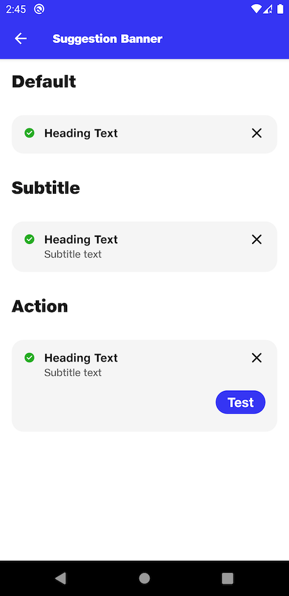

# Notification Toast

## Default
```kotlin
NitrozenSuggestionBanner(
    modifier = Modifier
        .fillMaxWidth(),
    title = "Heading Text",
    icon = com.fynd.nitrozen.R.drawable.ic_success_text_field
)
```

## Subtitle
```kotlin
NitrozenSuggestionBanner(
    modifier = Modifier
        .fillMaxWidth(),
    title = "Heading Text",
    subtitle = "Subtitle text",
    icon = com.fynd.nitrozen.R.drawable.ic_success_text_field
)

```

## Action
```kotlin
NitrozenSuggestionBanner(
    modifier = Modifier
        .fillMaxWidth(),
    title = "Heading Text",
    subtitle = "Subtitle text",
    icon = com.fynd.nitrozen.R.drawable.ic_success_text_field,
    primaryAction = NotificationAction(
        actionText = "Test",
        action = {}
    ),
    onCancel = {

    },
)

```

## Custom Style
```kotlin
NitrozenSuggestionBanner(
    modifier = Modifier
        .fillMaxWidth(),
    title = "Heading Text",
    subtitle = "Subtitle text",
    icon = com.fynd.nitrozen.R.drawable.ic_success_text_field,
    primaryAction = NotificationAction(
        actionText = "Test",
        action = {}
    ),
    style = NitrozenNotificationStyle.SuggestionBanner.Default.copy(
        backgroundColor = NitrozenTheme.colors.primary20,
        titleTextColor = NitrozenTheme.colors.primary50,
        subTitleColor = NitrozenTheme.colors.primary40,
        shape = NitrozenTheme.shapes.topRoundedXl,
        primaryButtonStyle = NitrozenButtonStyle.Filled.Default.copy(
            backgroundColorEnabled = NitrozenTheme.colors.success50,
        )
    )
)

```

## Preview
