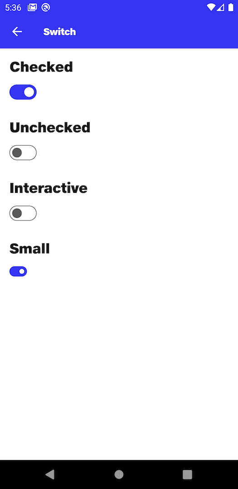

# Switch

## Checked
```kotlin
NitrozenSwitch(
    modifier = Modifier
        .padding(top = 16.dp),
    checked = true,
    onCheckedChange = {}
)
```

## Unchecked
```kotlin
NitrozenSwitch(
    modifier = Modifier
        .padding(top = 16.dp),
    checked = false,
    onCheckedChange = {}
)
```

## Interactive
```kotlin
var checkedState by remember {
    mutableStateOf(false)
}

NitrozenSwitch(
    modifier = Modifier
        .padding(top = 16.dp),
    checked = checkedState,
    onCheckedChange = {
        checkedState = it
    }
)
```

## Small
```kotlin
NitrozenSwitch(
    modifier = Modifier
        .padding(top = 16.dp),
    checked = true,
    onCheckedChange = {

    },
    configuration = NitrozenSwitchConfiguration.Small
)
```

## Preview
