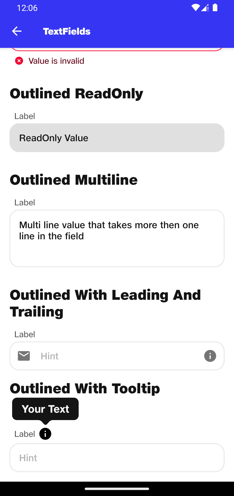

# TextFields

## Outlined
```kotlin
NitrozenOutlinedTextField(
    value = "",
    hint = "Hint",
    onValueChange = {},
    label = "Label",
    textFieldState = TextFieldState.Idle("Message goes here")
)
```

## Outlined - Success
```kotlin
NitrozenOutlinedTextField(
    value = "Valid value",
    hint = "Hint",
    onValueChange = {},
    label = "Label",
    textFieldState = TextFieldState.Success("Value is valid")
)
```

## Outlined - Error
```kotlin
NitrozenOutlinedTextField(
    value = "Invalid value",
    hint = "Hint",
    onValueChange = {},
    label = "Label",
    textFieldState = TextFieldState.Error("Value is invalid")
)
```

## Outlined - ReadOnly
```kotlin
NitrozenOutlinedTextFieldReadOnly(
    value = "ReadOnly Value",
    hint = "Hint",
    label = "Label",
    onClicked = {}
)
```

## Outlined - Multiline
```kotlin
NitrozenOutlinedTextField(
    value = "Multi line value that takes more then one line in the field",
    hint = "Hint",
    label = "Label",
    onValueChange = {},
    configuration = NitrozenTextFieldConfiguration.Outlined.Default.copy(
        maxLine = 2
    )
)
```

## Outlined - With leading and trailing
```kotlin
NitrozenOutlinedTextField(
    value = "",
    hint = "Hint",
    onValueChange = {},
    label = "Label",
    leadingIcon = {
        Icon(imageVector = Icons.Default.Email, contentDescription = null)
    },
    trailingIcon = {
        Icon(imageVector = Icons.Default.Info, contentDescription = null)
    }
)
```

## Outlined - With Tooltip
```kotlin
var tooltipVisible by remember { mutableStateOf(false) }

NitrozenOutlinedTextField(
    value = "",
    hint = "Hint",
    onValueChange = {},
    label = "Label",
    anchorView = {
        Icon(
            painterResource(id = R.drawable.ic_tooltip_info),
            contentDescription = null,
            modifier = Modifier
                .clickableWithoutRipple {
                    tooltipVisible = !tooltipVisible
                }
        )
    },
    toolTipText = "Your Text",
    onDismissRequest = {
        tooltipVisible = false
    },
    toolTipVisibility = tooltipVisible
)
```

## Preview


## Preview
|                                                 |                                               |
|-------------------------------------------------|-----------------------------------------------|
|  |  |
