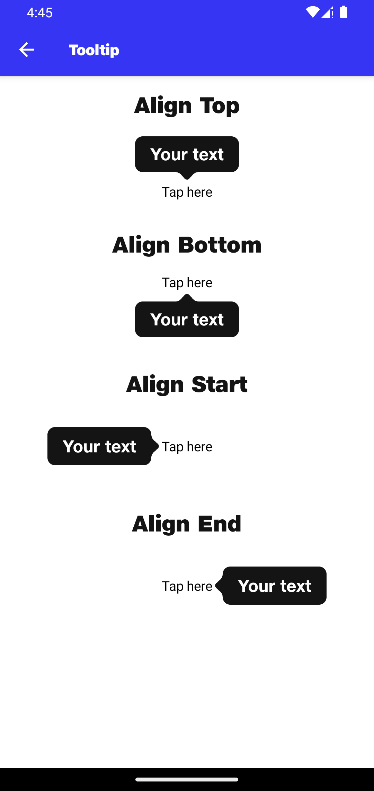

# Tooltip

## Align Top
```kotlin
var tooltipTopVisible by remember { mutableStateOf(true) }
Column(
    modifier = Modifier
        .height(70.dp),
    horizontalAlignment = Alignment.CenterHorizontally,
    verticalArrangement = Arrangement.Bottom
) {
    NitrozenTooltip(
        modifier = Modifier,
        tooltipText = "Your text",
        anchorView = {
            Text(
                modifier = Modifier
                    .clickableWithoutRipple {
                        tooltipTopVisible = !tooltipTopVisible
                    },
                text = "Tap here",
            )
        },
        configuration = NitrozenToolTipConfiguration(
            anchorEdge = AnchorEdge.Top,
            tipEdgePosition = TipEdgePosition.MIDDLE
        ),
        visibility = tooltipTopVisible,
        onDismissRequest = {
            tooltipTopVisible = false
        }
    )
}
```

## Align Bottom
```kotlin
var tooltipBottomVisible by remember { mutableStateOf(true) }
Column(
    modifier = Modifier
        .height(70.dp),
    horizontalAlignment = Alignment.CenterHorizontally,
    verticalArrangement = Arrangement.Top
) {
    NitrozenTooltip(
        modifier = Modifier,
        tooltipText = "Your text",
        anchorView = {
            Text(
                modifier = Modifier
                    .clickableWithoutRipple {
                        tooltipBottomVisible = !tooltipBottomVisible
                    },
                text = "Tap here",
            )
        },
        configuration = NitrozenToolTipConfiguration(
            anchorEdge = AnchorEdge.Bottom,
            tipEdgePosition = TipEdgePosition.MIDDLE
        ),
        visibility = tooltipBottomVisible,
        onDismissRequest = {
            tooltipBottomVisible = false
        }
    )
}
```

## Align Start
```kotlin
var tooltipStartVisible by remember { mutableStateOf(true) }
Column(
    modifier = Modifier
        .height(70.dp)
        .fillMaxWidth(),
    horizontalAlignment = Alignment.CenterHorizontally,
    verticalArrangement = Arrangement.Center
) {
    NitrozenTooltip(
        modifier = Modifier,
        tooltipText = "Your text",
        anchorView = {
            Text(
                modifier = Modifier
                    .clickableWithoutRipple {
                        tooltipStartVisible = !tooltipStartVisible
                    },
                text = "Tap here",
            )
        },
        configuration = NitrozenToolTipConfiguration(
            anchorEdge = AnchorEdge.Start,
            tipEdgePosition = TipEdgePosition.MIDDLE
        ),
        visibility = tooltipStartVisible,
        onDismissRequest = {
            tooltipStartVisible = false
        }
    )
}
```

## Align End
```kotlin
var tooltipEndVisible by remember { mutableStateOf(true) }
Column(
    modifier = Modifier
        .height(70.dp)
        .fillMaxWidth(),
    horizontalAlignment = Alignment.CenterHorizontally,
    verticalArrangement = Arrangement.Center
) {
    NitrozenTooltip(
        modifier = Modifier,
        tooltipText = "Your text",
        anchorView = {
            Text(
                modifier = Modifier
                    .clickableWithoutRipple {
                        tooltipEndVisible = !tooltipEndVisible
                    },
                text = "Tap here",
            )
        },
        configuration = NitrozenToolTipConfiguration(
            anchorEdge = AnchorEdge.End,
            tipEdgePosition = TipEdgePosition.MIDDLE
        ),
        visibility = tooltipEndVisible,
        onDismissRequest = {
            tooltipEndVisible = false
        }
    )
}
```


## Preview
